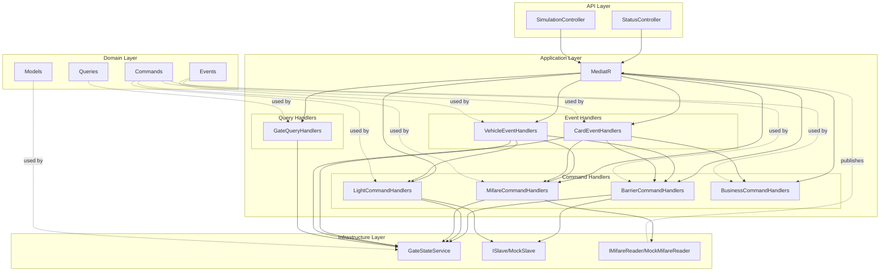
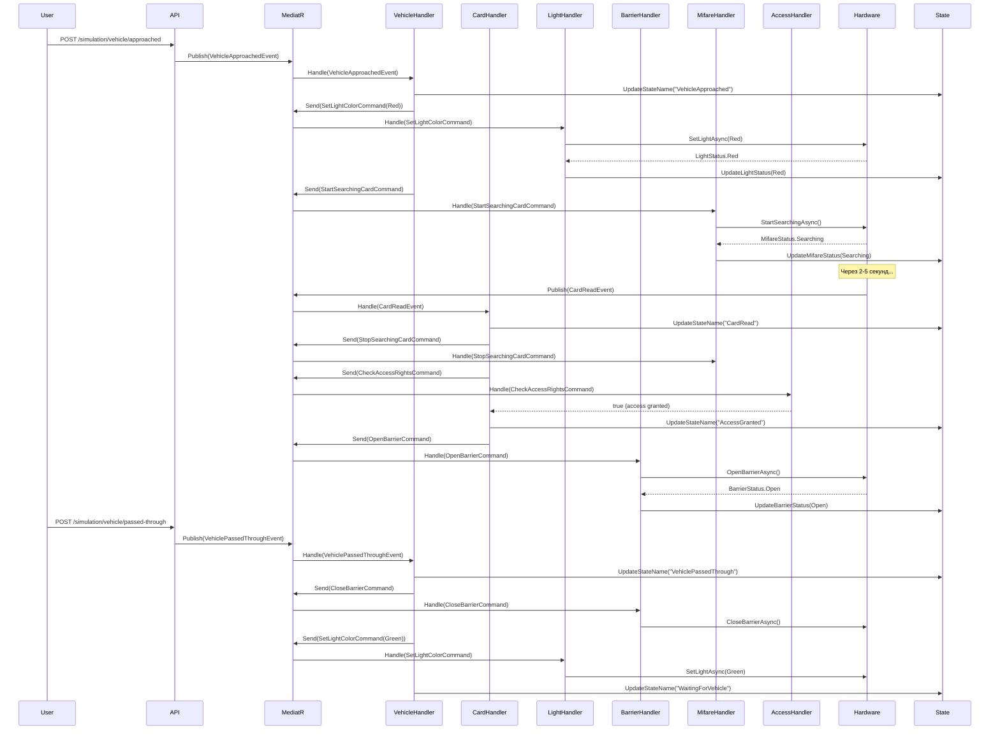
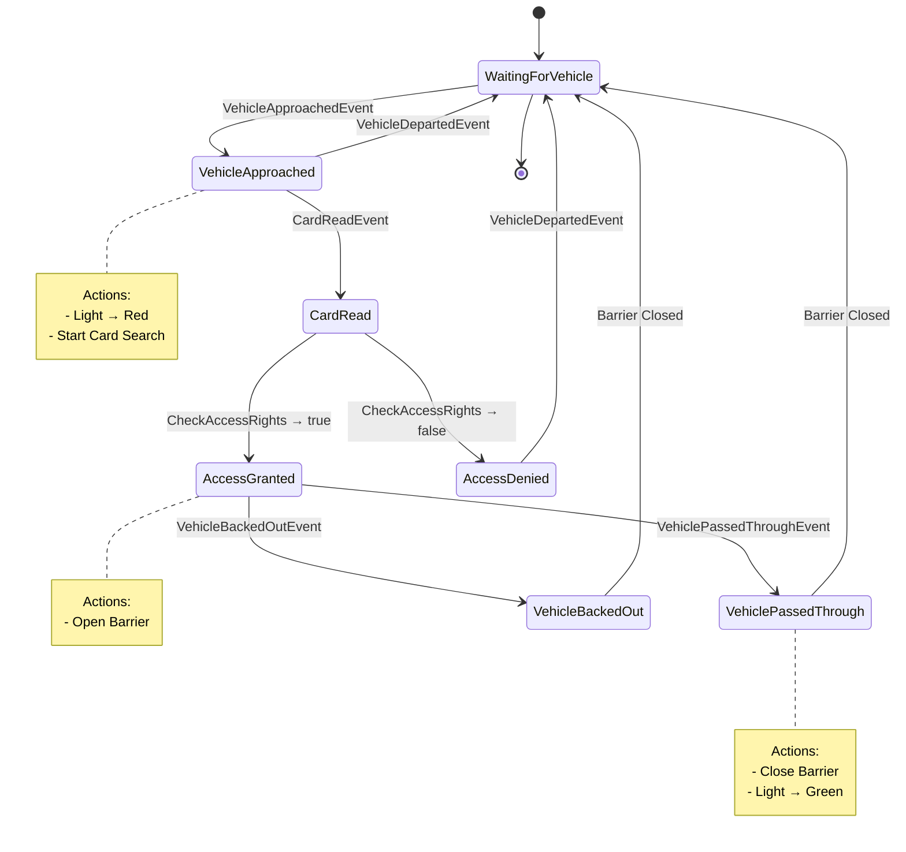
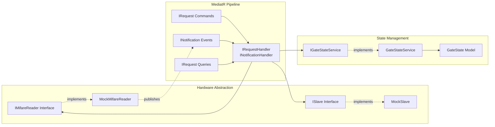

# Архитектурная диаграмма системы

## Общая архитектура

```mermaid
graph TB
    subgraph "API Layer"
        API[StatusController]
        SIM[SimulationController]
    end
    
    subgraph "Application Layer"
        MED[MediatR]
        
        subgraph "Event Handlers"
            VEH[VehicleEventHandlers]
            CEH[CardEventHandlers]
        end
        
        subgraph "Command Handlers"
            BCH[BarrierCommandHandlers]
            LCH[LightCommandHandlers]
            MCH[MifareCommandHandlers]
            BUCH[BusinessCommandHandlers]
        end
        
        subgraph "Query Handlers"
            GQH[GateQueryHandlers]
        end
    end
    
    subgraph "Infrastructure Layer"
        STATE[GateStateService]
        SLAVE[ISlave/MockSlave]
        MIFARE[IMifareReader/MockMifareReader]
    end
    
    subgraph "Domain Layer"
        EVENTS[Events]
        COMMANDS[Commands]
        QUERIES[Queries]
        MODELS[Models]
    end
    
    API --> MED
    SIM --> MED
    
    MED --> VEH
    MED --> CEH
    MED --> BCH
    MED --> LCH
    MED --> MCH
    MED --> BUCH
    MED --> GQH
    
    VEH --> BCH
    VEH --> LCH
    VEH --> MCH
    CEH --> BCH
    CEH --> MCH
    CEH --> BUCH
    
    BCH --> SLAVE
    LCH --> SLAVE
    MCH --> MIFARE
    
    BCH --> STATE
    LCH --> STATE
    MCH --> STATE
    VEH --> STATE
    CEH --> STATE
    GQH --> STATE
    
    MIFARE -.publishes.-> MED
    
    EVENTS -.used by.-> VEH
    EVENTS -.used by.-> CEH
    COMMANDS -.used by.-> BCH
    COMMANDS -.used by.-> LCH
    COMMANDS -.used by.-> MCH
    COMMANDS -.used by.-> BUCH
    QUERIES -.used by.-> GQH
    MODELS -.used by.-> STATE
```

## Поток событий успешного въезда

```mermaid
sequenceDiagram
    participant User
    participant API
    participant MediatR
    participant VehicleHandler
    participant CardHandler
    participant LightHandler
    participant BarrierHandler
    participant MifareHandler
    participant AccessHandler
    participant Hardware
    participant State
    
    User->>API: POST /simulation/vehicle/approached
    API->>MediatR: Publish(VehicleApproachedEvent)
    MediatR->>VehicleHandler: Handle(VehicleApproachedEvent)
    
    VehicleHandler->>State: UpdateStateName("VehicleApproached")
    VehicleHandler->>MediatR: Send(SetLightColorCommand(Red))
    MediatR->>LightHandler: Handle(SetLightColorCommand)
    LightHandler->>Hardware: SetLightAsync(Red)
    Hardware-->>LightHandler: LightStatus.Red
    LightHandler->>State: UpdateLightStatus(Red)
    
    VehicleHandler->>MediatR: Send(StartSearchingCardCommand)
    MediatR->>MifareHandler: Handle(StartSearchingCardCommand)
    MifareHandler->>Hardware: StartSearchingAsync()
    Hardware-->>MifareHandler: MifareStatus.Searching
    MifareHandler->>State: UpdateMifareStatus(Searching)
    
    Note over Hardware: Через 2-5 секунд...
    Hardware->>MediatR: Publish(CardReadEvent)
    MediatR->>CardHandler: Handle(CardReadEvent)
    
    CardHandler->>State: UpdateStateName("CardRead")
    CardHandler->>MediatR: Send(StopSearchingCardCommand)
    MediatR->>MifareHandler: Handle(StopSearchingCardCommand)
    
    CardHandler->>MediatR: Send(CheckAccessRightsCommand)
    MediatR->>AccessHandler: Handle(CheckAccessRightsCommand)
    AccessHandler-->>CardHandler: true (access granted)
    
    CardHandler->>State: UpdateStateName("AccessGranted")
    CardHandler->>MediatR: Send(OpenBarrierCommand)
    MediatR->>BarrierHandler: Handle(OpenBarrierCommand)
    BarrierHandler->>Hardware: OpenBarrierAsync()
    Hardware-->>BarrierHandler: BarrierStatus.Open
    BarrierHandler->>State: UpdateBarrierStatus(Open)
    
    User->>API: POST /simulation/vehicle/passed-through
    API->>MediatR: Publish(VehiclePassedThroughEvent)
    MediatR->>VehicleHandler: Handle(VehiclePassedThroughEvent)
    
    VehicleHandler->>State: UpdateStateName("VehiclePassedThrough")
    VehicleHandler->>MediatR: Send(CloseBarrierCommand)
    MediatR->>BarrierHandler: Handle(CloseBarrierCommand)
    BarrierHandler->>Hardware: CloseBarrierAsync()
    
    VehicleHandler->>MediatR: Send(SetLightColorCommand(Green))
    MediatR->>LightHandler: Handle(SetLightColorCommand)
    LightHandler->>Hardware: SetLightAsync(Green)
    
    VehicleHandler->>State: UpdateStateName("WaitingForVehicle")
```

## Конечный автомат состояний

```mermaid
stateDiagram-v2
    [*] --> WaitingForVehicle
    
    WaitingForVehicle --> VehicleApproached: VehicleApproachedEvent
    
    VehicleApproached --> CardRead: CardReadEvent
    VehicleApproached --> WaitingForVehicle: VehicleDepartedEvent
    
    CardRead --> AccessGranted: CheckAccessRights → true
    CardRead --> AccessDenied: CheckAccessRights → false
    
    AccessGranted --> VehiclePassedThrough: VehiclePassedThroughEvent
    AccessGranted --> VehicleBackedOut: VehicleBackedOutEvent
    
    AccessDenied --> WaitingForVehicle: VehicleDepartedEvent
    
    VehiclePassedThrough --> WaitingForVehicle: Barrier Closed
    VehicleBackedOut --> WaitingForVehicle: Barrier Closed
    
    WaitingForVehicle --> [*]
    
    note right of VehicleApproached
        Actions:
        - Light → Red
        - Start Card Search
    end note
    
    note right of AccessGranted
        Actions:
        - Open Barrier
    end note
    
    note right of VehiclePassedThrough
        Actions:
        - Close Barrier
        - Light → Green
    end note
```

## Компоненты и их взаимодействие

```mermaid
graph LR
    subgraph "Hardware Abstraction"
        ISlave[ISlave Interface]
        IMifare[IMifareReader Interface]
        MockSlave[MockSlave]
        MockMifare[MockMifareReader]
        
        ISlave -.implements.-> MockSlave
        IMifare -.implements.-> MockMifare
    end
    
    subgraph "State Management"
        IGateState[IGateStateService]
        GateState[GateStateService]
        StateModel[GateState Model]
        
        IGateState -.implements.-> GateState
        GateState --> StateModel
    end
    
    subgraph "MediatR Pipeline"
        Commands[IRequest Commands]
        Events[INotification Events]
        Queries[IRequest Queries]
        Handlers[IRequestHandler<br/>INotificationHandler]
        
        Commands --> Handlers
        Events --> Handlers
        Queries --> Handlers
    end
    
    Handlers --> ISlave
    Handlers --> IMifare
    Handlers --> IGateState
    
    MockMifare -.publishes.-> Events
```
