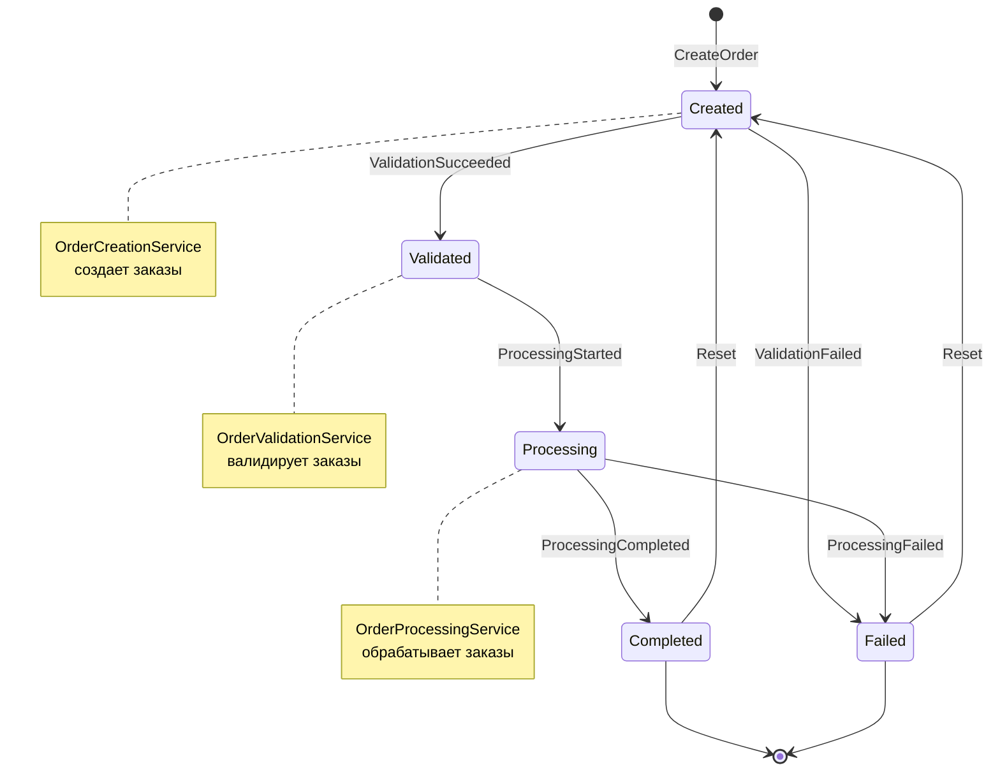
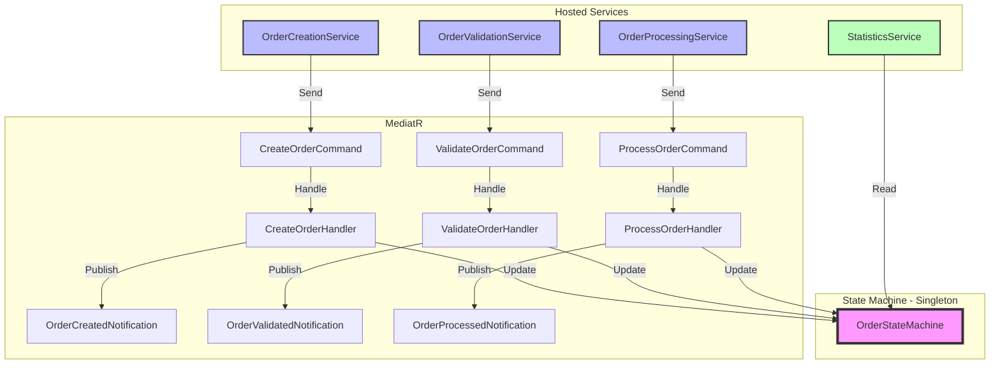
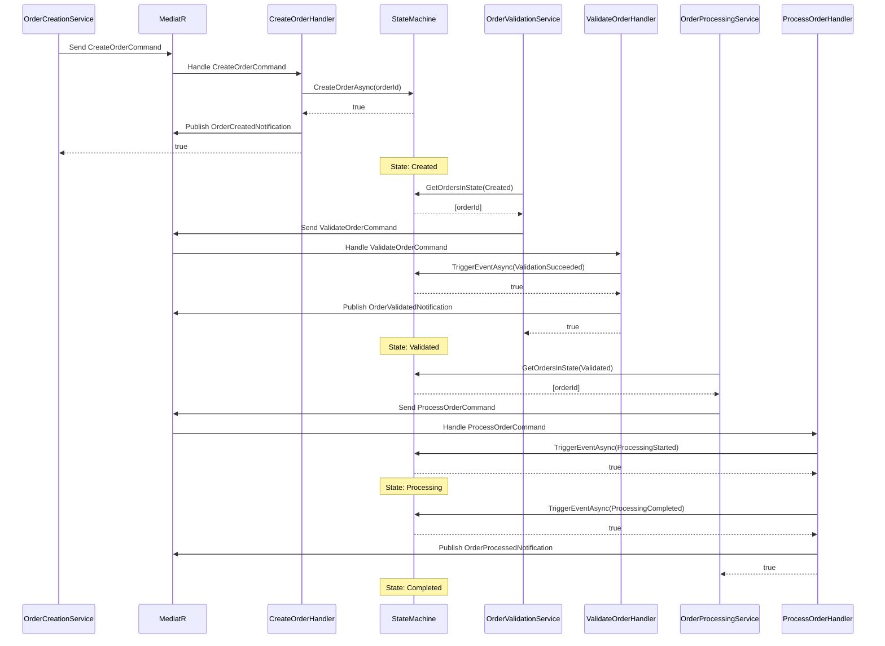

# Диаграмма конечного автомата

## Описание переходов

| Текущее состояние | Событие | Новое состояние | Описание |
|-------------------|---------|-----------------|----------|
| Created | ValidationSucceeded | Validated | Заказ прошел валидацию |
| Created | ValidationFailed | Failed | Заказ не прошел валидацию |
| Validated | ProcessingStarted | Processing | Начата обработка заказа |
| Processing | ProcessingCompleted | Completed | Обработка успешно завершена |
| Processing | ProcessingFailed | Failed | Ошибка при обработке |
| Failed | Reset | Created | Сброс провального заказа |
| Completed | Reset | Created | Сброс завершенного заказа |

## Схема взаимодействия компонентов

## Временная диаграмма

