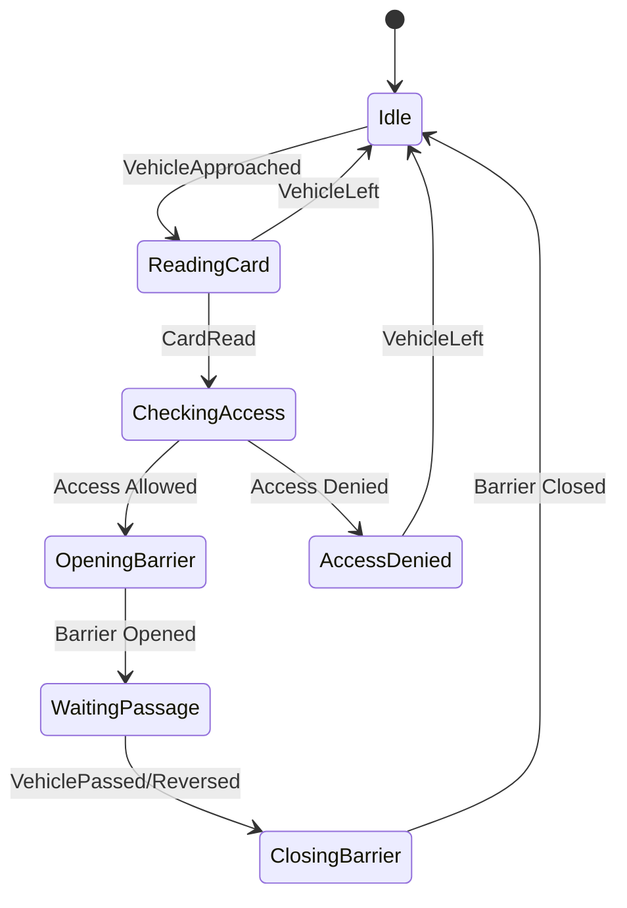

# Система управления въездной стойкой парковки

ASP.NET приложение на основе паттерна Mediator для управления конечным автоматом въездной стойки.

## Архитектура

### Основные компоненты

```
┌─────────────────────────────────────────────────────────────┐
│                     ASP.NET API Layer                        │
│  ┌────────────────────┐         ┌──────────────────────┐    │
│  │  EntryController   │────────▶│   HTTP Endpoints     │    │
│  └────────────────────┘         └──────────────────────┘    │
└─────────────────────────────────────────────────────────────┘
                            │
                            ▼
┌─────────────────────────────────────────────────────────────┐
│                    MediatR Event Bus                         │
│  ┌──────────────────────────────────────────────────────┐   │
│  │  События (Notifications) + Команды (Requests)        │   │
│  └──────────────────────────────────────────────────────┘   │
└─────────────────────────────────────────────────────────────┘
                            │
        ┌───────────────────┼───────────────────┐
        ▼                   ▼                   ▼
┌──────────────┐   ┌──────────────┐   ┌──────────────┐
│   Event      │   │   Command    │   │    State     │
│  Handlers    │   │   Handlers   │   │   Context    │
│              │   │              │   │  (Singleton) │
└──────────────┘   └──────────────┘   └──────────────┘
        │                   │
        ▼                   ▼
┌─────────────────────────────────────────────────────────────┐
│                    Equipment Services                        │
│  ┌──────────┐  ┌──────────┐  ┌──────────┐  ┌──────────┐   │
│  │ Barrier  │  │  Light   │  │  Mifare  │  │  Access  │   │
│  │ Service  │  │ Service  │  │ Service  │  │  Check   │   │
│  └──────────┘  └──────────┘  └──────────┘  └──────────┘   │
└─────────────────────────────────────────────────────────────┘
```

## Состояния системы



### Состояния (EntryState)

1. **Idle** - Ожидание автомобиля
2. **ReadingCard** - Чтение карты
3. **CheckingAccess** - Проверка прав доступа
4. **OpeningBarrier** - Открытие шлагбаума
5. **WaitingPassage** - Ожидание проезда
6. **ClosingBarrier** - Закрытие шлагбаума
7. **AccessDenied** - Доступ запрещен
8. **EquipmentError** - Ошибка оборудования

## Ключевые особенности

### ✅ Singleton State Machine
- Контекст состояния (IStateContext) - Singleton
- Все события обрабатываются последовательно
- Thread-safe через lock

### ✅ Mediator Pattern
- События (INotification) для асинхронных уведомлений
- Команды (IRequest) для запросов к оборудованию
- Слабая связанность компонентов

### ✅ Тестирование с любого состояния
```csharp
// Можно начать тест с любого состояния!
Setup(EntryState.WaitingPassage, cardNumber: "TEST123");
await Mediator.Publish(new VehiclePassed());
AssertState(EntryState.Idle);
```

### ✅ Mock-friendly
Все зависимости - интерфейсы, легко мокаются в тестах

## Установка и запуск

### Требования
- .NET 8.0 SDK
- IDE: Visual Studio 2022 / Rider / VS Code

### Запуск API

```bash
cd src/ParkingEntry.Api
dotnet run
```

API будет доступен на `https://localhost:5001` (или HTTP порт из консоли)

Swagger UI: `https://localhost:5001/swagger`

### Запуск тестов

```bash
cd tests/ParkingEntry.Tests
dotnet test
```

Или запустить все тесты из корня:

```bash
dotnet test
```

## Использование API

### Получить текущий статус

```bash
GET /api/entry/status
```

Ответ:
```json
{
  "currentState": "Idle",
  "cardNumber": null,
  "timestamp": "2025-01-15T10:30:00Z"
}
```

### Отправить событие "Автомобиль подъехал"

```bash
POST /api/entry/events/vehicle-approached
```

### Отправить событие "Карта прочитана"

```bash
POST /api/entry/events/card-read
Content-Type: application/json

{
  "cardNumber": "CARD12345"
}
```

### Сбросить систему

```bash
POST /api/entry/reset
```

## Примеры сценариев

### Успешный въезд

```bash
# 1. Автомобиль подъезжает
curl -X POST https://localhost:5001/api/entry/events/vehicle-approached

# 2. Карта прочитана
curl -X POST https://localhost:5001/api/entry/events/card-read \
  -H "Content-Type: application/json" \
  -d '{"cardNumber": "VALID_CARD"}'

# 3. Автомобиль проезжает
curl -X POST https://localhost:5001/api/entry/events/vehicle-passed

# Проверить статус
curl https://localhost:5001/api/entry/status
```

### Отказ в доступе

```bash
# 1. Автомобиль подъезжает
curl -X POST https://localhost:5001/api/entry/events/vehicle-approached

# 2. Карта отклонена (номер "DENIED")
curl -X POST https://localhost:5001/api/entry/events/card-read \
  -H "Content-Type: application/json" \
  -d '{"cardNumber": "DENIED"}'

# 3. Автомобиль уезжает
curl -X POST https://localhost:5001/api/entry/events/vehicle-left
```

## Структура проекта

```
ParkingEntry/
├── src/
│   ├── ParkingEntry.Core/          # Основная бизнес-логика
│   │   ├── Domain/                 # Доменные модели и события
│   │   │   ├── EntryState.cs
│   │   │   ├── EquipmentStatus.cs
│   │   │   └── Events/
│   │   │       └── DomainEvents.cs
│   │   ├── Application/            # Слой приложения
│   │   │   ├── Commands/
│   │   │   ├── Handlers/           # MediatR handlers
│   │   │   ├── Services/           # Интерфейсы сервисов
│   │   │   └── StateMachine/
│   │   └── Infrastructure/         # Реализации
│   │       ├── StateContext.cs
│   │       └── TimeoutManager.cs
│   └── ParkingEntry.Api/           # ASP.NET API
│       ├── Controllers/
│       │   └── EntryController.cs
│       ├── Services/               # Mock-сервисы
│       │   └── MockServices.cs
│       └── Program.cs
└── tests/
    └── ParkingEntry.Tests/         # Unit-тесты
        ├── EntryStateMachineTestBase.cs
        ├── LightBehaviorTests.cs
        ├── CardReaderTests.cs
        ├── FinalStateTests.cs      # Тесты без начальных фаз
        └── FullScenarioTests.cs
```

## Расширение системы

### Добавление нового сервиса

1. Создать интерфейс в `Core/Application/Services/`
2. Создать команды в `Core/Application/Commands/`
3. Создать handler в `Core/Application/Handlers/`
4. Зарегистрировать в `Program.cs`

### Добавление нового состояния

1. Добавить в enum `EntryState`
2. Создать event handler для перехода
3. Добавить тесты

### Добавление таймаутов

```csharp
// В обработчике
var timerId = await _timeoutManager.StartTimerAsync(
    "WriteCard",
    TimeSpan.FromSeconds(10),
    async () => {
        await _mediator.Publish(new OperationTimeout("WriteCard"));
    },
    cancellationToken);

// Отменить при успехе
_timeoutManager.CancelTimer(timerId);
```

## Преимущества архитектуры

✅ **Разделение ответственности** - каждый handler отвечает за одно событие  
✅ **Тестируемость** - можно тестировать с любого состояния  
✅ **Расширяемость** - добавление функций не ломает существующий код  
✅ **Читаемость** - явные события и команды вместо switch/if  
✅ **Независимость** - слабая связанность через интерфейсы  

## Режим "Выезд"

Для режима выезда можно:
1. Создать отдельный `ExitController` и `ExitState`
2. Переиспользовать те же сервисы оборудования
3. Создать свои handlers для логики выезда
4. Выбор режима через конфигурацию при запуске

## Технологии

- .NET 8.0
- ASP.NET Core Minimal API
- MediatR 12.4.1
- NUnit 4.2.2
- FluentAssertions 6.12.1
- Moq 4.20.72

## Авторы

RPS Development Team

## Лицензия

Copyright (c) RPS. All rights reserved.
